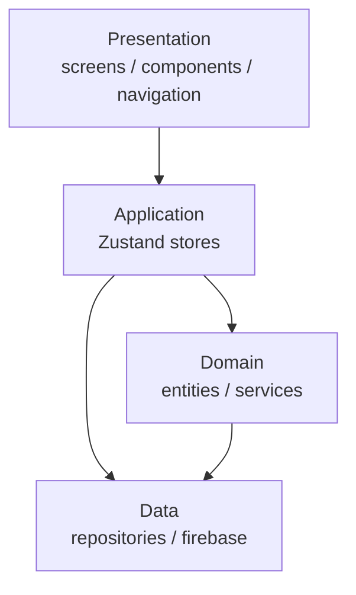

# 아키텍처 — 친구 스케줄 매칭 앱

## 레이어 구조



## 레이어별 책임

| 레이어 | 위치 | 책임 |
|---|---|---|
| Presentation | `src/presentation/` | 화면 렌더링, 사용자 입력 처리 |
| Application | `src/application/stores/` | 전역 상태 관리 (Zustand) |
| Domain | `src/domain/` | 핵심 비즈니스 규칙, 데이터 타입 정의 |
| Data | `src/data/` | Firebase 데이터 접근, 외부 API 연동 |

## 디렉토리 구조

```
src/
├── presentation/
│   ├── screens/        # 화면 단위 컴포넌트 (CalendarScreen 등)
│   ├── components/     # 공통 재사용 UI 컴포넌트
│   └── navigation/     # React Navigation 설정
├── application/
│   └── stores/         # Zustand store (scheduleStore, friendStore, inviteStore)
├── domain/
│   ├── entities/       # 타입 정의 (User, Schedule, Invite, Friend)
│   └── services/       # 비즈니스 로직 (겹치는 일정 계산, 초대 가능 여부 판단)
└── data/
    ├── repositories/   # Firebase 접근 추상화 (scheduleRepo, friendRepo 등)
    └── firebase/       # Firebase 초기화 및 설정
```

## 핵심 기능의 레이어 흐름

| 기능 | Presentation | Application | Domain | Data |
|---|---|---|---|---|
| 캘린더 날짜 선택 | CalendarScreen | scheduleStore | Schedule entity | Firestore 조회 |
| 친구 가용 상태 조회 | FriendStatusList | friendStore | availabilityService | Firestore 조회 |
| 초대 발송 | InviteScreen | inviteStore | Invite entity | FCM 푸시 + Firestore 저장 |
| 채팅방 자동 생성 | ChatRoomScreen | inviteStore | ChatRoom entity | Realtime DB 생성 |

## 새 코드 추가 시 위치 기준

- **새 화면** → `src/presentation/screens/`
- **공통 버튼·카드 등 UI** → `src/presentation/components/`
- **전역 상태** → `src/application/stores/`
- **비즈니스 규칙 (ex. 일정 겹침 계산)** → `src/domain/services/`
- **Firebase 읽기/쓰기** → `src/data/repositories/`
