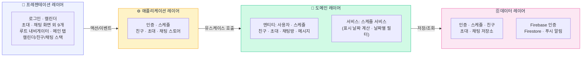

<!-- _class: title -->
<!-- _paginate: false -->

# 📅 친구 스케줄 매칭 앱

**"언제 돼?" 없는 약속 문화를 만들다**

 

앱 프로그래밍 과제 발표 &nbsp;·&nbsp; 2026년 6월

`github.com/kmk-123/app-programming-ai`

---

<!-- _class: problem -->

## 💢 문제 정의

  😩
  단톡방에 <strong>"언제 돼?" 한 마디</strong> 남기고 — 답 취합까지 평균 <strong>3일 소요</strong>

  📆
  <strong>친구의 스케줄을 알 수 없어</strong> — 일정이 있는 친구에게도 무작정 초대 발송

---

## 🎯 비전 & 솔루션

> **"각자의 일정을 등록하면 — 누가 되는지 한눈에, 초대부터 채팅까지 자동으로"**

 

  

    📋
    <strong>스케줄 등록</strong>
    고정 반복 + 일회성
  

  
→

  

    👥
    <strong>가용 확인</strong>
    날짜 선택 시 친구 현황 표시
  

  
→

  

    ✉️
    <strong>초대 & 응답</strong>
    수락 / 거절 사유 전달
  

---

<!-- _paginate: false -->

## 🏗️ 아키텍처 설계 — 레이어드 아키텍처

---

## 🛠️ 기술 스택 & 진행 현황

| 영역 | 기술 |
|---|---|
| 프레임워크 | React Native (Expo 54) |
| 언어 | TypeScript |
| 상태 관리 | Zustand 5 |
| 라우팅 | React Navigation v7 |
| 인증 | Firebase Auth |
| DB / 채팅 | Firestore + onSnapshot |
| 알림 (예정) | Firebase FCM |

  

29

완료 태스크

  

10

예정 태스크

**전체 진행률 — 73%**

남은 것: **FCM 푸시 알림**, Firestore 보안 규칙,  
Android 빌드 · 배포, 발표 자료

